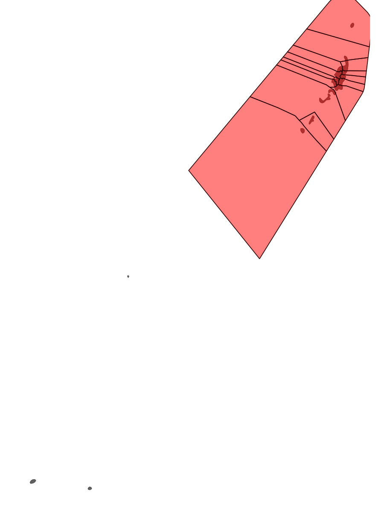

::: lead
In this vignette, we will explore how to generate a historical report using the functions from the **reefcloudReporting** package and the data from the ReefCloud Public Dashboard from the Palau region in the style of one of the many [Status and Trends Reports from Palau](https://drive.google.com/file/d/1JE5T6sP-E9BftM60OOziZ_G09xYaL6LO/view).
:::

```{r}
#| label: loadPackages
#| include: false
library(tidyverse)
library(sf)
library(knitr)
library(patchwork)
#library(reefcloudReporting)
options(digits = 3)
```

# Introduction

Coral reefs are important ecosystems that serve as habitat and provides many ecosystem functions, especially to the regional communities of coastal nations. Yet, reefs around the world have been impacted by both natural and anthropogenic disturbances that affect the ecosystem and the services they provide.

While the reefs in Palau have been relatively resilient to the impacts of these stressors, several super-typhoons have had great impact to the reefs there. To assess the impact, long-term monitoring needs to be consistently conducted to document the changes over time and to report on the effects of conservation or management actions.

Here, we look at the current monitoring year of data in 2016.

# Methods

Reefs have been surveyed biannually or more depending on disturbances at the different reef sites. At both the shallow (3m) and deep (10m) transects, five 50 m transects are placed and photographed. This data has been previously manually scored using CPCe, but were later fed into ReefCloud for a more efficient analysis of the image data from human annotations. Benthic categories were scored accordingly, to genus level if possible and aggregated into the different benthic categories.

ReefCloud processes the raw data that have been made publicly available, using models that account for both spatial and temporal variations to produce data and trends shown on the [Public Dashboard](https://reefcloud.ai/dashboard/ "ReefCloud Public Dashboard"). We then access this data using the API and the reefcloudReporting package to develop this report. 

# Results

```{r}
#| label: readRegionalSummary
#| tbl-cap: "Summary of key tier characteristics"
#| warning: false
source("./R/get_regional_summary.R")

info <- get_regional_summary(1705) 
```

Across Palau, `r info$data_contributors` have surveyed `r info$site_count` sites with a total of `r info$photo_quadrats` images taken (@fig-plotMap; @tbl-readRegionalSummary).

```{r}
#| label: fig-plotMap
#| fig-cap: "Map of region and surrounding reef sites"
#| warning: false
#source("./R/generate_map.R")

#map_plot <- generate_map(1705)


```

```{r}
#| label: tbl-readRegionalSummary
#| tbl-cap: "Overview of key characteristics"
#| warning: false

info_tbl <- tibble(
  field = names(info),
  value = sapply(info, function(x) {
    if (length(x) > 1) paste(x, collapse = ", ") else x
  })
  ) |> 
  mutate(field = str_to_title(gsub("_", " ", field)))

names(info_tbl) <- names(info_tbl) |> 
  str_to_title()

knitr::kable(info_tbl) 
```

A detailed breakdown of the site locations and their local regions can be found in (@tbl-readSiteSummary).

```{r}
#| label: tbl-readSiteSummary
#| tbl-cap: "Summary and characteristics of Survey Sites in the Region"
#| warning: false
source("./R/get_site_summary.R")

sites <- get_site_summary(1705)

sites_tbl <- sites[1:10,] |> 
  st_drop_geometry() |> 
  dplyr::select(-latitude, -longitude)

names(sites_tbl) <- names(sites_tbl) |> 
  gsub("_", " ", x = _) |>
  str_to_title()

knitr::kable(sites_tbl)
```

## Overview

Across all 42 sites both shallow and deep in 2016, we can see that the number of sites with high coral cover (>30%) is slightly less than half, while most sites had low macroalgae cover (@fig-plotDonut1, @fig-plotDonut2, @fig-plotDonut3, @fig-plotDonut4) 

```{r}
#| label: fig-plotDonut1
#| fig-cap: "Proportion of shallow sites within different Hard Coral cover bands in the region in 2016"
#| warning: false
source("./R/plot_donut.R")

HC_s_donut_plot <- plot_donut(1705, year = 2016, depth = "shallow", cover_type = "hard coral")
HC_s_donut_plot
```

```{r}
#| label: fig-plotDonut2
#| fig-cap: "Proportion of shallow sites within different Macroalgae cover bands in the region in 2016"
#| warning: false
source("./R/plot_donut.R")

MA_s_donut_plot <- plot_donut(1705, year = 2016, depth = "shallow", cover_type = "macroalgae")
MA_s_donut_plot
```

```{r}
#| label: fig-plotDonut3
#| fig-cap: "Proportion of deep sites within different Hard Coral cover bands in the region in 2016"
#| warning: false
source("./R/plot_donut.R")

HC_d_donut_plot <- plot_donut(1705, year = 2016, depth = "deep", cover_type = "hard coral")
```

```{r}
#| label: fig-plotDonut4
#| fig-cap: "Proportion of deep sites within different Macroalgae cover bands in the region in 2016"
#| warning: false
source("./R/plot_donut.R")

HC_d_donut_plot <- plot_donut(1705, year = 2016, depth = "deep", cover_type = "macroalgae")
```

## Site-level cover

Looking at the sites individually, Nikko and Taoch sites have highest cover with many sites displaying very low coral cover (@fig-plotHCCover, @tbl-plotHCCover). 

```{r}
#| label: fig-plotHCCover
#| fig-cap: "Site-level Hard Coral cover across the region"
#| warning: false
source("./R/plot_site_cover.R")

HC_cover_plot <- plot_site_cover(1705, year = 2016, cover_type = "hard coral", depth = "shallow")

HC_cover_plot$plot
```

```{r}
#| label: tbl-plotHCCover
#| tbl-cap: "Site-level Hard Coral cover across the region"
#| warning: false
HC_cover_tbl <- HC_cover_plot$df.sum[1:10,] |> 
  dplyr::select(-date, -type_code, -low, -high, -latitude, -longitude) |> 
  dplyr::mutate(depth = stringr::str_to_title(depth)) |> 
  dplyr::mutate(type = stringr::str_to_title(type)) |> 
  dplyr::rename(modelled_mean = mean, modelled_median = median)
  
names(HC_cover_tbl) <- names(HC_cover_tbl) |> 
  gsub("_", " ", x = _) |>
  str_to_title()

knitr::kable(HC_cover_tbl)
```

While macroalgae cover across all sites remain low, Ngelukes does stand out with higher macroalgae cover than the rest, and might need to be re-assessed in the future (@fig-plotMACover, @tbl-plotMACover).

```{r}
#| label: fig-plotMACover
#| fig-cap: "Site-level Macroalgae cover across the region"
#| warning: false
source("./R/plot_site_cover.R")

MA_cover_plot <- plot_site_cover(1705, year = 2016, cover_type = "macroalgae", depth = "shallow")

MA_cover_plot$plot
```

```{r}
#| label: tbl-plotMACover
#| tbl-cap: "Site-level Macroalgae cover across the region"
#| warning: false
MA_cover_tbl <- MA_cover_plot$df.sum[1:10,] |> 
  dplyr::select(-date, -type_code, -low, -high, -latitude, -longitude) |> 
  dplyr::mutate(depth = stringr::str_to_title(depth)) |> 
  dplyr::mutate(type = stringr::str_to_title(type)) |> 
  dplyr::rename(modelled_mean = mean, modelled_median = median)

names(MA_cover_tbl) <- names(MA_cover_tbl) |> 
  gsub("_", " ", x = _) |>
  str_to_title()

knitr::kable(MA_cover_tbl)
```

## Benthic composition

In general, benthic composition shows much of the same story as before, but highlights a few important points (@fig-plotSiteComposition1, @fig-plotSiteComposition2). Soft coral remains to be a low component of the reefs in 2016, but Turf Algae dominates much of the benthos both shallow and deep. Crustose coralline algae also appears more commonly at some sites that have lower Hard Coral cover and may be indicative of recovery, such as at Peleliu shallow. 

```{r}
#| label: fig-plotSiteComposition1
#| fig-cap: "Site-level stacked composition across the region in 2016"
#| warning: false
source("./R/plot_site_composition.R")

site_composition1 <- plot_site_composition(1705, year = 2016, depth = "shallow")

site_composition1$plot
```
```{r}
#| label: fig-plotSiteComposition2
#| fig-cap: "Site-level stacked composition across the region in 2016"
#| warning: false
source("./R/plot_site_composition.R")

site_composition2 <- plot_site_composition(1705, year = 2014, depth = "deep")

site_composition2$plot
```

## Temporal comparisons

Comparing this year's monitoring data to previous survey, both Palau and most of the sites have seen cover increase, with several sites having large increase in absolute hard coral cover: Nikko (+23.648%),  Ngelukes (+22.174%), Peleliu (+19.886%), Ngemelis (+10.895%), and Ngeremlengui Patch Reefs	(+10.161%). However, several sites also show large declines in absolute hard coral cover: Nikko 1 (-19.172%), and Ngerdiluches (-13.758%). These are sites that need some management action to identify the source of the decline (@fig-plotCoverComparisonHC, @tbl-getCoverComparisonHC).

```{r}
#| label: tbl-getCoverComparisonHC
#| tbl-cap: "Modelled benthic cover comparison of survey Sites between two years: 2014 and 2016"
#| warning: false
source("./R/get_cover_comparison.R")

covercomparison1 <- get_cover_comparison(1705, cover_type = "hard coral", depth = "shallow", years = c(2014, 2016))

covercomparison1_tbl <- covercomparison1 |> 
  dplyr::mutate(row_type = stringr::str_to_title(row_type), 
                depth = stringr::str_to_title(depth), 
                cover_type = stringr::str_to_title(cover_type)) |> 
  dplyr::select(-tier_id, -year_first, -year_last, -n_sites) |> 
  dplyr::relocate(row_type, .before = cover_type) 

names(covercomparison1_tbl) <- names(covercomparison1_tbl) |> 
  gsub("_", " ", x = _) |>
  stringr::str_to_title()

knitr::kable(covercomparison1_tbl)
```

```{r}
#| label: fig-plotCoverComparisonHC
#| tbl-cap: "Modelled benthic cover comparison of survey Sites between two years: 2014 and 2016"
#| warning: false
source("./R/plot_cover_comparison.R")

covercomparison1_plot <- plot_cover_comparison(covercomparison1, metric = "abs")

covercomparison1_plot
```

The compositional data of the reefs through time also show a similar pattern (@fig-plotYearComposition). The change in hard coral cover seems to have been taken over by others in 2016, with a substantial increase. In past years, the change in hard coral cover has been taken over by turf algae instead, which generally represented a loss of space. The others category encompasses various different categories of benthic organisms and may warrant a further study to identify the changes through time. 

```{r}
#| label: fig-plotYearComposition
#| fig-cap: "Yearly stacked composition across the tier"
#| warning: false
source("./R/plot_year_composition.R")

year_composition <- plot_year_composition(1705, depth = "none", fill_by = "group_code")

year_composition$plot
```

## Conclusion and Recommendations

Looking over the data through time, we can see that hard coral cover has varied (@fig-plotHCTrend). In the current year of monitoring, we see a slight increase in coral cover, though this small increase does not match the past coral cover from 2009 and 2010 when coral cover was at its highest. Continued monitoring is needed to see if the reefs here recover back to past levels.

```{r}
#| label: fig-plotHCTrend
#| fig-cap: "Trends of Hard Coral cover across the region"
#| warning: false
source("./R/plot_temporal_cover.R")

HC_trend_plot <- plot_temporal_cover(1705, cover_type = "hard coral")

HC_trend_plot$plot

HC_trend_plot$df.sum
```

While most sites have seen an increase in cover from the last survey, there are still substantial difference from the peak coral cover in 2009. Additionally, several sites seem to have had a large decline in cover as well. These sites will need to be further investigated for the source of the declines. Further monitoring and management action will be taken if no recovery is seen in the next survey.